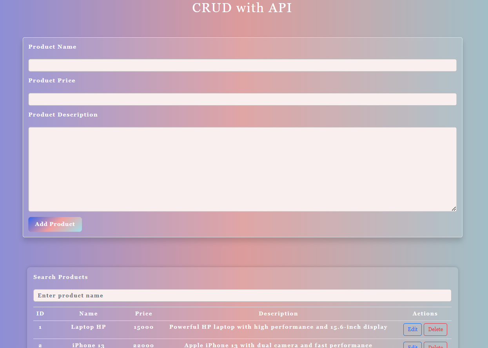

# **Product CRUD Application**


# For the live demo, the frontend is connected to a public API to ensure smooth functionality (Note: The search feature is not available in this API). However, the original backend code is still included in the repository as comments for reference

## **Overview**

This is a simple and efficient **<a href="https://www.codecademy.com/articles/what-is-crud">CRUD</a> (Create, Read, Update, Delete)** application built with modern web technologies:

- **Frontend**: HTML, CSS, JavaScript, Bootstrap
- **Backend**: Node.js, Express.js
- **Database**: MySQL

The application allows users to manage product records through an intuitive and responsive interface, and includes search functionality to filter products by name.

---

## **Features**

- Add new products to the database with a name, price, and description.
- View all products listed in the database.
- Update existing product details.
- Delete products from the database.
- **Search**: Filter products based on their names.

---

## **Technologies Used**

- **Frontend**: HTML, CSS, JavaScript, Bootstrap
- **Backend**: Node.js, Express.js
- **Database**: MySQL
- **API**: RESTful API for managing product data

---

## **Installation**

### **Prerequisites**

Make sure the following tools and services are installed on your system:

- [Node.js](https://nodejs.org/en/)
- [MySQL](https://www.mysql.com/)
- [CORS](https://www.npmjs.com/package/cors) for Cross-Origin Resource Sharing in the backend.

### **Setup Steps**

1. **Clone the repository**:
   ```bash
   git clone https://github.com/El-fnan/CRUD.git
   cd CRUD
   ```

2. **Install dependencies**:
   You need to install `node_modules` for both frontend and backend:
   ```bash
   npm install
   ```

3. **Install Express for the backend**:
   ```bash
   npm install express
   ```

4. **Configure the database**:
   - Create a MySQL database.
   - Update the connection settings in `backend/dbConnection.js` with your MySQL database credentials.

5. **Run the application**:
   ```bash
   node backend/index.js
   ```

6. **Frontend**:
   Open your browser and visit `http://localhost:3000` to view the frontend.

7. **Backend**:
   The backend runs at `http://localhost:5000`.

---

## **API Endpoints**

| Method  | Endpoint                 | Description                     |
|---------|--------------------------|---------------------------------|
| `GET`   | `/products`              | Fetch all product records       |
| `GET`   | `/products/search?`      | Search products by name         |
| `GET`   | `/products/:id`          | Fetch product by ID             |
| `POST`  | `/products`              | Add a new product               |
| `PUT`   | `/products`              | Update an existing product      |
| `DELETE`| `/products`              | Delete a product by ID          |

---

## **Project Structure**

- **frontend/**: Contains all frontend files (HTML, CSS, JavaScript, Bootstrap).
- **backend/**: Contains all backend files (Node.js, Express, MySQL connection).

---

## **License**

This project is licensed under the **MIT License**.

---

## **Contributing**

Feel free to fork the repository and submit pull requests with new features or bug fixes. For any issues, please create an issue on GitHub.

---

## **Author**

**Amr Mohammed**
